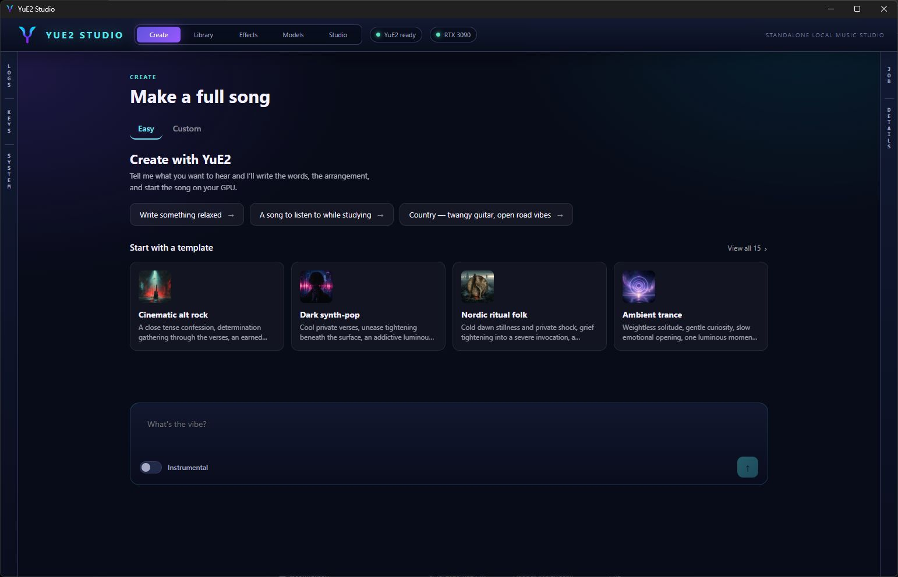
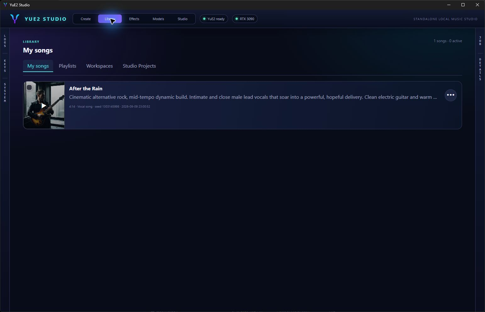
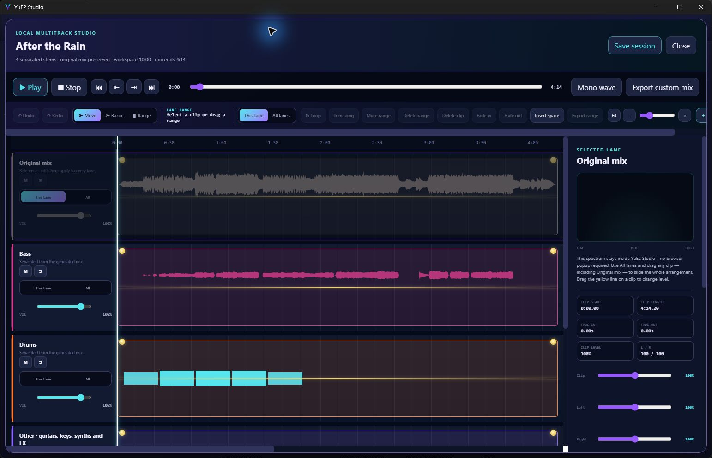
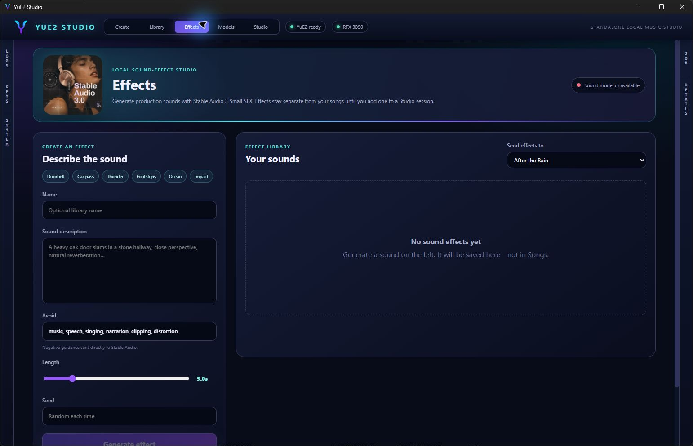
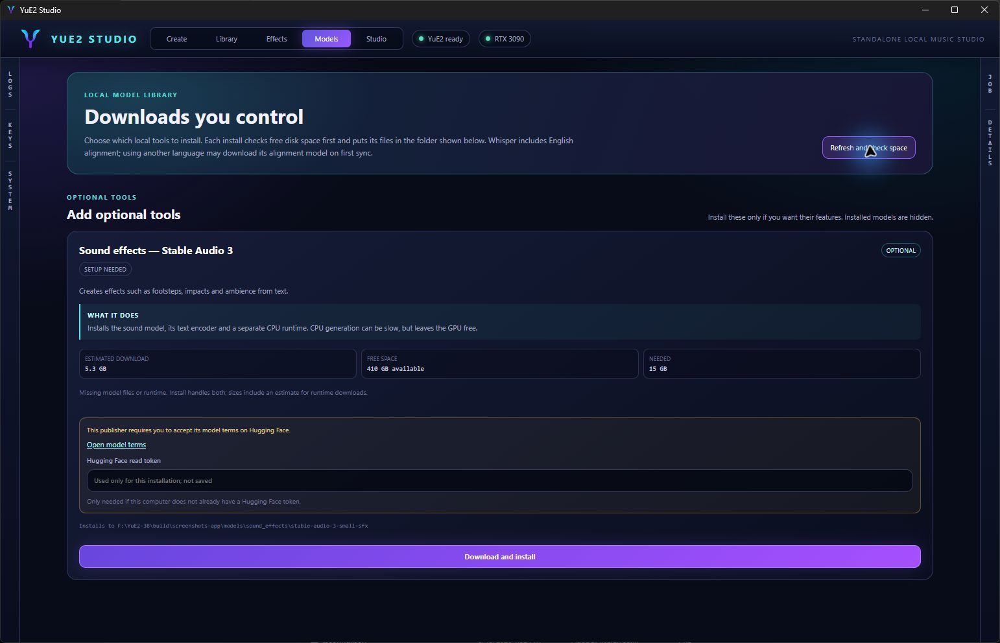

# YuE2 Studio

YuE2 Studio is a native Windows desktop application for writing, generating, arranging and exporting music with the local [YuE2-3B](https://huggingface.co/m-a-p/YuE2-3B) model. It has a song library, lyric synchronization, cover art, stem separation, video tools and optional local sound effects. The application runs on your computer; no music-generation account is required.

## Start here

Read the [complete user guide](USER_GUIDE.md) for first-run setup, model choices, song and sound prompting, Studio editing, combining tracks, exports, troubleshooting and backups.

## Gallery











## Install or build

For most people, use the Windows installer from the project releases. It creates the application and data folders, and includes the local backend, Python and FFmpeg. Models remain optional downloads from the **Models** page after the app opens.

To build a local copy from source on Windows:

1. Install **Python 3.11**, the current Node.js LTS, [Rust](https://rustup.rs/), and Visual Studio 2022 Build Tools with **Desktop development with C++**.
2. Run [`Setup YuE2 Studio.bat`](Setup%20YuE2%20Studio.bat).
3. Launch `YuE2 Studio.exe`, open **Models**, and select the features you want. The app checks free space, reports progress, verifies downloads and keeps optional features separate.

The source setup creates `outputs`, `models`, and its private backend environment. It does not download model weights, tokenizers, checkpoints, or feature runtimes. Those are installed only after you choose them in the app. Music generation needs an NVIDIA GPU with BF16 support; This app has been used on an RTX 3090 with 24 GB VRAM; smaller cards and longer jobs are not guaranteed to fit. Cover art also uses an NVIDIA GPU. Other optional features have their own requirements and are shown in Models.

To create the distributable Windows installer from a source checkout, run:

```powershell
pwsh -ExecutionPolicy Bypass -File scripts\build-installer.ps1
```

That script stages a clean payload and writes the installer and SHA-256 file to `release`. It requires the same Windows build prerequisites plus NSIS (installed by the Tauri toolchain when needed).

## Privacy and local data

Songs, logs, downloads and settings are stored under `outputs`. The Gemini writing helper is optional and uses a key supplied by the person running the app. Keys are stored locally in `outputs/settings/api-keys.json`; this path is ignored by Git and is excluded from installer payloads and release artifacts. Never commit that file.

The repository intentionally excludes downloaded models, Python runtimes, generated media, logs, caches, installer staging, executable builds and credentials. `python/model_catalog.json` contains only the public, pinned download manifest needed by the Models page; it contains no local Hugging Face cache or credentials.

## Development checks

```powershell
npm run build
npm run tauri build -- --no-bundle
```

The project version is 0.5.1.

## Licenses and upstream work

YuE2 Studio uses the published YuE2-3B inference package and model. Each model download retains its upstream license and may have additional terms. In particular, Stable Audio 3 requires accepting its Hugging Face access terms before it can be downloaded. See [LICENSE](LICENSE), [THIRD_PARTY_NOTICES.md](THIRD_PARTY_NOTICES.md), and [APP_THIRD_PARTY_NOTICES.md](APP_THIRD_PARTY_NOTICES.md).


## New in 0.5.1

- Video Studio visualizers now use derived multi-color palettes, full-spectrum Peak and Disc modes, cinematic atmosphere, richer Orbit depth, and corrected Bars/Skyline rendering.

## New in 0.5.0

- Sony Woosh-Flow joins Stable Audio in Effects. Select the engine, use a simple prompt, and adjust CFG or sampling. Woosh produces up to five seconds of mono audio played through both speakers. Its weights use CC-BY-NC (non-commercial).
- Models includes an optional Woosh installer with verified downloads, free-space checks, cancellation, tokenizer files, and a private Python 3.12/CUDA runtime. Already installed features stay hidden. All existing music, lyrics, artwork, stem and Stable Audio installers remain available.
- Studio plays imported mono audio through both ears and exports it to both channels.
- Combine sound tracks merges selected imported lanes with their timing and rendered edits. Restore original tracks brings back their pre-combine state; edits to the combined lane are discarded when restoring.
- Effects includes optional Gemini prompt assistance and model-specific sampling controls. Short, simple prompts are recommended for Woosh.

Model weights, private runtimes, API keys and personal media are not bundled in the source or installer.
